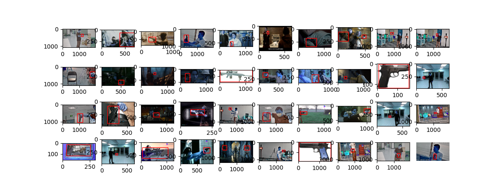
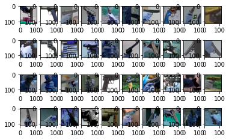

# Gun Detection Datasets
The largest gun dataset with 51K annotated images for detectoin, and other 51K images for classification

## Source of Gun Images 

The sources where we collect our gun image dataset include:

- We first collect a lot of gun images from the IMFDB website \cite{IMFDB} - a movie internet firearms database. Then we use a CNN-based gun detector to roughly label the data. Finally we manually check and relabel the inaccurate labels. 
- We collect some images from publicly available websites of some of the papers \cite{Olmos,Lim,UCF}.  Note that many of these images overlap with the first source and we have to manually clean them. The images from the video footages in \cite{UCF} are used in \cite{Lim}. We do not use most of them because their resolution is very low and different from real cameras.  
- We deploy a few cameras in a private office and capture some gun detection data in a real scene. The data we collect this way is about a couple of thousands. 
- Many negative samples for gun detection and classification are collected from the failed cases in our deployment cameras.    

## Terms 

By downloading the LinkSprite gun detectiond dataset, the Receiving Entity agrees to:

- Cite the following publication (https://arxiv.org/abs/2105.01058)

      @misc{Linksprite_Gun_dataset,
      author = “Delong Qi, and Weijun Tan, and Zhifu Liu, and Qi Yao, and Jingfeng Liu”,
      title = “{A Gun Detection Dataset and Searching for Embedded Device Solutions”,
      Journal = {ArXiv preprint 2105.01058},
      Year = {2021}
      }

- No further distribution of the data without express written permission from LinkSprite. Instead, third parties should apply for the data to LinkSprite directly.

- Comply with the licensing terms stated below.

### LinkSprite Gun Detection Dataset LICENSING

LinkSprite makes this Standard Reference Database available citing the attributions given in SOURCES.txt. LinkSprite understands the content has been made available under a Creative Commons variant. Should one or more samples be alternatively licensed then the owner or legal representative should contact LinkSprite via datasets@linksprite.com and identify particular images.

Users and prospective users of this database should:
a) note binding licensing terms at https://creativecommons.org/licenses/
b) understand that the Database is subject to change at any time
c) understand that the LinkSprite makes no guarantee or warranty of non-infringement

Please email datasets@linksprite.com to get access to the gun detection datasets.

## Sample Images
- Sample images for gun detection 

  

- Sample images for gun classification 

  

